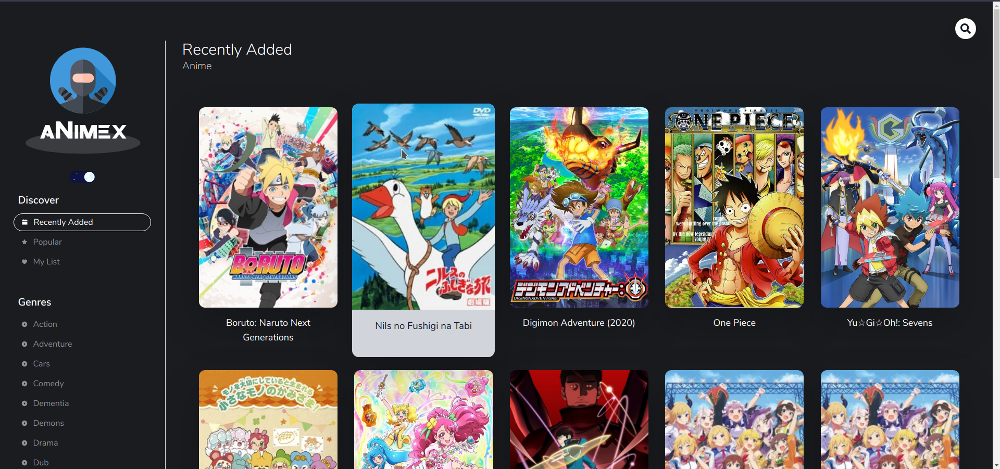

# Anime Web App with Reactjs.

## Check it live here

[www.animex.ninja](https://www.animex.ninja/)



An Ad Free Anime Streaming web app to give you a better experience.

## Api Reference

- [API REPO](https://github.com/routayush1/animexninja-api)
  This api is being used in this project.

## Getting Started

These instructions will get you a copy of the project up and running on your local machine for development and testing purposes. See deployment for notes on how to deploy the project on a live system.

### Prerequisites
FIRST YOU NEED TO CLONE [API REPO](https://github.com/routayush1/animexninja-api) AND RUN IT.
You need to note api local host url.you have to create a tunnel for your api local_host through NGROK.
Go to next.config.js file on the root of the project and put your NGROK url inside the env object


```
 env: {
    key: process.env.COUNT_API_KEY,
    URL: "YOUR_NGROK_API_URL/api/",
  }
```

### Installing
Clone the Repository and run
```
npm install
npm run dev
```


## Built With

- Front End
  - [React JS](https://reactjs.org/)
  - [Next JS](https://nextjs.org/)
- Styling Utilities
  - [Tailwindcss](https://tailwindcss.com/)
  - [Styled Components](https://www.styled-components.com)
  - [Twin Macro](https://www.npmjs.com/package/twin.macro)
- State Management
  - [Redux](https://redux.js.org/)
  - [React-Redux](https://react-redux.js.org/)
  - [Redux-Thunk](https://github.com/reduxjs/redux-thunk)
  - [Redux-Persist](https://github.com/rt2zz/redux-persist#readme)

## Contributing

Pull requests are welcome. For major changes, please open an issue first to discuss what you would like to change.

Please make sure to update tests as appropriate.

## Credits

- [Fidalgodev](https://github.com/fidalgodev)
  The Developer of [movies.fidalgo.dev](https://movies.fidalgo.dev/discover/Popular) inspired us for creating this amazing website.

## Authors

- [AyushRout](https://github.com/routayush1)
- [SohamSingh](https://github.com/sohamsingh29)
- [Gaurav](https://github.com/gauravdh9)

## License

[MIT](https://choosealicense.com/licenses/mit/)
